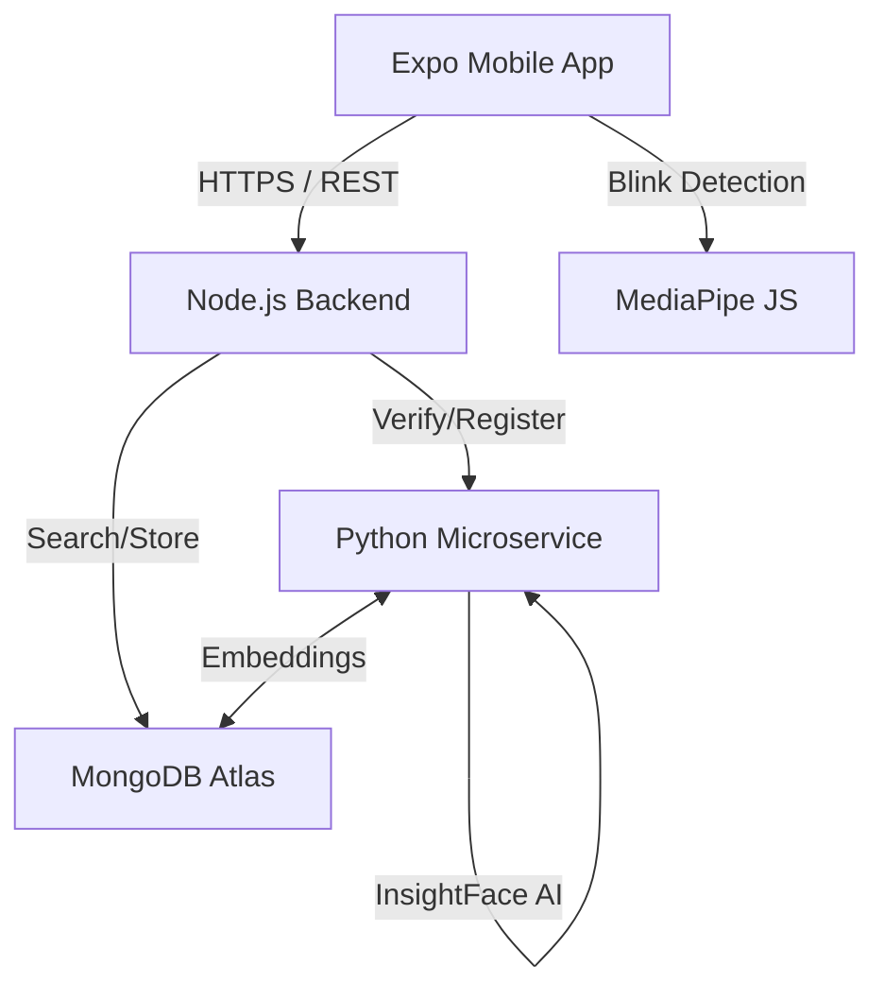

# FaceAttend Pro 👤📸

FaceAttend Pro is a **manager-level, kiosk-based attendance management system** powered by advanced face recognition and liveness detection. Unlike traditional systems, it minimizes employee friction by utilizing a single kiosk device managed by an administrator.

---

## 🚀 New Features (Latest Updates)

- **🛡️ Blink-to-Verify (Liveness)**: Integrated MediaPipe Face Mesh in the mobile app to ensure "Blink to Capture". This prevents spoofing using static photos.
- **🚫 Cross-Manager Duplicate Prevention**: The system now automatically rejects face registrations if the person is already registered under the same manager.
- **⚡ InsightFace Integration**: Fully migrated to a high-speed Python microservice using the InsightFace engine for production-grade accuracy (~0.2s identification).
- **🔒 Manager-Aware Isolation**: All data (employees, attendance, face embeddings) is now strictly isolated by `managerId`. 

---

## 🌟 Key Features

### 🔐 Manager-Based Kiosk Mode
- Only managers need to log in.
- Employees scan their faces at the kiosk—no personal accounts or passwords needed for workers.

### 📸 Pro Face Recognition
- **InsightFace**: Uses the Buffalo_SC model (optimized for speed/accuracy) via a dedicated Python microservice.
- **MediaPipe**: Real-time face mesh analysis on the device for pose and liveness (blink) detection.

### 📊 Attendance Intelligence
- **Automatic IN/OUT**: The system intelligently determines if a scan is a check-in or check-out based on existing daily records.
- **Real-time Analytics**: Dashboard overview of attendance percentages, late arrivals, and active employees.

---

## 🧠 System Architecture



---

## 🛠️ Tech Stack

- **Frontend**: React Native (Expo), TypeScript, Expo Router, MediaPipe Face Mesh.
- **Backend (API)**: Node.js, Express, MongoDB (Mongoose), JWT.
- **AI Service**: Python 3.9+, FastAPI, InsightFace, OpenCV, NumPy.

---

## 📦 Project Structure

```text
├── ExpoApp/             # React Native Mobile Application (Kiosk UI)
├── backend/             # Node.js API Layer (Business Logic)
├── face_microservice/   # Python AI Engine (Face Recognition)
└── README.md            # Comprehensive Guide
```

---

## ⚙️ Installation & Full Guide

### 1. Database Setup
- Create a MongoDB Atlas cluster.
- Whitelist your IP and obtain the connection string.

### 2. AI Microservice Setup (Python)
The microservice handles face embedding generation and similarity matching.
```bash
cd face_microservice
pip install -r requirements.txt
# Create .env:
# MONGO_URI=your_mongodb_uri
# FACE_MODEL=buffalo_sc
python main.py
```

### 3. Backend Setup (Node.js)
The main controller for your application data and authentication.
```bash
cd backend
npm install
# Create .env:
# MONGODB_URI=your_mongodb_uri
# JWT_SECRET=your_jwt_secret
# FACE_SERVICE_URL=http://your-microservice-url
npm run dev
```

### 4. Expo Mobile App Setup
```bash
cd ExpoApp
npm install
npx expo start
```
*Note: For camera and blink detection to work, ensure you run this on a physical device via the Expo Go app.*

---

## 🔑 Environment Variables Reference

| Variable | Location | Description |
| :--- | :--- | :--- |
| `MONGODB_URI` | `/backend/.env` | Connection string for MongoDB. |
| `JWT_SECRET` | `/backend/.env` | Secret key for manager authentication. |
| `FACE_SERVICE_URL` | `/backend/.env` | URL where the Python microservice is running. |
| `MONGO_URI` | `/face_microservice/.env` | Must match the backend's MONGODB_URI. |
| `FACE_MODEL` | `/face_microservice/.env` | `buffalo_sc` (Fast) or `buffalo_l` (Accurate). |

---

## ✅ Operation Guide

1. **Manager Login**: Log in using your admin credentials.
2. **Employee Registration**:
   - Go to "Employees" -> "Register".
   - The camera will ask the employee to **Blink** to capture the face.
   - The system checks if the face exists under your account.
3. **Marking Attendance**:
   - Open the "Kiosk" or "Scan" tab.
   - Employee blinks -> Face is recognized -> Record is updated as "Checked In" or "Checked Out".

---

## 🏁 Future Roadmap
- [ ] **Offline Mode**: Local storage of attendance if internet fails.
- [ ] **Export to Excel**: One-click monthly report generation.
- [ ] **Multi-Kiosk Sync**: Sync attendance across multiple devices in one office.

---

## 🤝 Support
If you encounter issues with face recognition accuracy, ensure the `FACE_MODEL` in the microservice is set to `buffalo_sc` for mobile-captured images or check the `VERIFY_THRESHOLD` in `main.py`.

⭐ **Give this project a star if it helped you!**
